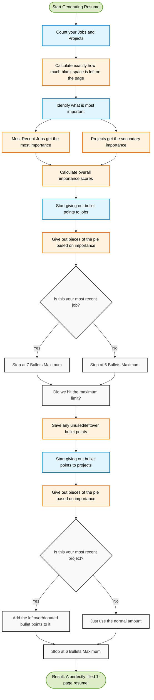

# How the Smart Resume Layout Builder Works

This document explains the secret sauce behind how the AI automatically decides exactly how many bullet points to write for your resume. The main goal of this system is to ensure your resume fits perfectly onto **exactly one page**—never spilling over to a second page, and never looking embarrassingly empty.

Here is a straightforward explanation of how the system achieves this!

---

## 1. The "Page Budget" Rule 
Think of a single piece of paper as having a strict "budget" of space. 

Every time you add a new company you worked for, or a new project you built, the bold title of that job takes up vertical space on the page. The system looks at how many jobs and projects you have in total, subtracts the space taken up by their titles, and calculates exactly how much room is left for the actual bullet points.

* **Example:** If you only have 1 job and 1 project, you have a ton of room left over for bullet points. If you have 4 jobs and 3 projects, you have very little room left for bullet points.

## 2. The "Star of the Show" Rule
Once the system knows exactly how many total bullet points will fit on the page, it has to decide who gets them. 

Not all jobs are equal! Recruiters care the absolute most about your **most recent job**. Therefore, the system automatically acts like a human resume writer:
* It gives the biggest piece of the pie to your newest job.
* It gives a medium piece of the pie to your older jobs.
* It gives a smaller piece of the pie to your personal side-projects.

## 3. The "Anti Wall-of-Text" Rule
Imagine you only have 1 job in your entire history. The system's math might calculate: *"Great! You have lots of space! Let's give this job 18 bullet points!"*

However, a recruiter will never read a giant wall of 18 bullet points. It looks terrible. To stop this, the AI has a strict speed limit: **No job is ever allowed to have more than 7 bullet points**, and no side project can have more than 6. 

## 4. The "Donation" System (Rollover)
Because of the speed limit mentioned above, the system might have extra bullet points it wasn't allowed to use. 

If the system wanted to give your main job 11 bullet points, but it was stopped at 7, it has 4 "leftover" bullet points. Instead of throwing them away and leaving the bottom half of your resume blank and empty, the system takes those 4 extra points and generously **donates** them to your side projects! 

This guarantees that every square inch of your resume is perfectly optimized, giving you a beautiful, dense, highly professional one-page layout every single time.

---

### Visual Flowchart
*(For developers or curious minds, here is the visual logic of the rules explained above!)*

