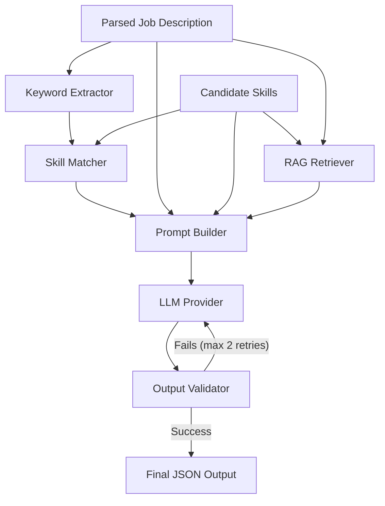

# AI Pipeline Architecture Documentation

The AI module of the Job Info Extractor is designed to generate highly-targeted, ATS-optimized resume bullet points tailored to a candidate's specific background and a target job description. The architecture relies on an advanced internal processing pipeline featuring strict dependency-injection rules, a localized execution environment via **Ollama**, and **Retrieval-Augmented Generation (RAG)**.

This document breaks down the logical flow and the responsibilities of each module.

---

## 1. High-Level Control Flow

When the frontend dispatches a generation request to the `/generate-resume` API, the process initiates inside `ResumePipeline`:

---

## 2. Abstraction Framework (`ai/interfaces/` & `ai/llm/`)

To ensure the business logic is entirely decoupled from the underlying Large Language Model or third-party service logic, the core enforces strict object-oriented inheritance.

- **`LLMProvider`**: An abstract python class that mandates a single function contract: `generate(prompt: str) -> str`.
- **`OllamaProvider`**: The concrete class currently running the application. It bypasses any heavyweight `langchain` logic directly pointing standard `requests` payloads at `http://localhost:11434/api/generate` relying statically on `deepseek-coder:1.3b`.
- **`OpenAIProvider`**: A mapped but disabled architecture scaffolding allowing seamless migration to zero-shot models utilizing API keys if later requested.

---

## 3. Data Processing Modules

### Keyword Extractor (`ai/keyword_extractor.py`)
This module pulls 10-15 core targeted requirements directly out of the raw scraped web page utilizing simple LLM extraction requests. It prioritizes frameworks, libraries, and core responsibilities, returning a strictly parsed JSON string array.

### Skill Matcher (`ai/skill_matcher.py`)
Small LLMs often "hallucinate" technologies a candidate doesn't actually possess just to satisfy strong prompt enforcement.
The Skill Matcher functions as a rigid gatekeeper:
It performs an array intersection comparing the `Candidate Skills` injected by the user against the `Keyword Extractor` output. The generated strings outputted later by the generator are mathematically bound to *only* allow traits surviving this matcher phase.

---

## 4. The RAG Engine (`ai/rag/`)

Retrieval-Augmented Generation guarantees the output mimics perfect industry-standard resume aesthetics rather than generic conversational outputs.

- **`Embeddings`**: Converts natural text arrays into dense mathematical vectors. The active engine maps down to `OllamaEmbeddings` executing via `nomic-embed-text`.
- **`InMemoryVectorStore`**: A dependency-free Python mathematical list mapper that executes Cosine Similarity scoring. It allows skipping bulky libraries like `faiss` or `chromadb`.
- **`RAGRetriever`**: Holds ~7 manually curated "Seed Examples" of perfect ATS bullet point structures. Submits a semantic query joining the user skills and Job Description to selectively pull out the top 3 examples most closely resembling what the final bullet points should look like.

---

## 5. Composition and Fallback

### Prompt Builder (`ai/prompt_builder.py`)
Produces the exact deterministic monolithic string shipped to the LLM. It injects:
1. The 3 nearest RAG seed examples to imitate.
2. The gate-kept intersected candidate traits.
3. The raw scraped HTTP Job Description.
4. Static behavioral rules (Must be exactly 3-8 points, must contain metric impacts, must be JSON only).

### Output Validator (`ai/validator.py`)
A highly fault-tolerant parser guarding against localized model degradation:
- Utilizes regular expressions (`re.DOTALL`) to surgically map the internal JSON boundaries out of the raw response, dynamically pruning conversation buffers (e.g., "Certainly, here are your bullet points:").
- Converts valid structures into Pydantic-like maps.
- Tests sequence bounds to ensure the UI won't crash when iteratively mapping over array states. 

If the logic or mathematical traits fail validation bounds, the `Pipeline` catches the internal `ValueError`, discards the generation, and forces exactly one or two retry sequences against Ollama before gracefully dumping into an API fallback mechanism.
