# Comprehensive Database Architecture & Design Report (Extended)

This master document outlines the complete database architecture for the AI Resume Maker platform. It covers the optimal technology stack, user authentication strategy, a massive unified Entity-Relationship database schema (including both core and extended professional entities), and detailed architectural deep-dives for edge cases.

---

## 1. Recommendations & Technology Stack

Given that this application uses a **FastAPI** backend and a **Next.js** frontend, here is the recommended approach for the data layer:

> [!TIP]
> **Primary Database:** **PostgreSQL**
> Relational databases are perfect for highly interconnected entities like Profiles, Experiences, Projects, and Certifications. It handles the complex joins required to fetch an entire "User Vault" payload for the LLM effortlessly.

* **ORM:** `SQLAlchemy` (with `asyncpg` for asynchronous query support matching FastAPI speeds).
* **Migrations:** `Alembic` (to strictly track database schema changes).
* **Authentication:** **JWT (JSON Web Tokens)** managed natively by FastAPI or via an external identity provider like **Supabase**.
* **Storage:** AWS S3 (or equivalent blob storage) to hold the compiled `.pdf` resume files and any generated cover letters.

---

## 2. Unified Entity-Relationship (ER) Diagram

This diagram maps every entity of the platform—from core professional details to extended accomplishments and application tracking.

```mermaid
erDiagram
    USERS ||--o| USER_PROFILES : has
    USERS ||--o| USER_SETTINGS : configures
    USERS ||--o{ USER_EXPERIENCES : has
    USERS ||--o{ USER_EDUCATIONS : has
    USERS ||--o{ USER_SKILLS : has
    USERS ||--o{ USER_PROJECTS : has
    USERS ||--o{ USER_SOCIAL_LINKS : has
    USERS ||--o{ USER_CERTIFICATIONS : earns
    USERS ||--o{ USER_LANGUAGES : speaks
    USERS ||--o{ USER_AWARDS : receives
    USERS ||--o{ USER_PUBLICATIONS : publishes
    USERS ||--o{ USER_VOLUNTEERING : has
    USERS ||--o{ JOB_APPLICATIONS : tracks
    JOB_APPLICATIONS ||--o| RESUMES : generates
    JOB_APPLICATIONS ||--o| COVER_LETTERS : generates

    USERS {
        uuid id PK
        string email
    }

    USER_PROFILES {
        uuid id PK
        uuid user_id FK
    }
    
    USER_SETTINGS {
        uuid id PK
        uuid user_id FK
    }

    USER_SOCIAL_LINKS {
        uuid id PK
        uuid user_id FK
    }

    USER_EXPERIENCES {
        uuid id PK
        uuid user_id FK
    }

    USER_EDUCATIONS {
        uuid id PK
        uuid user_id FK
    }

    USER_SKILLS {
        uuid id PK
        uuid user_id FK
    }

    USER_PROJECTS {
        uuid id PK
        uuid user_id FK
    }
    
    USER_CERTIFICATIONS {
        uuid id PK
        uuid user_id FK
    }
    
    USER_LANGUAGES {
        uuid id PK
        uuid user_id FK
    }
    
    USER_AWARDS {
        uuid id PK
        uuid user_id FK
    }
    
    USER_PUBLICATIONS {
        uuid id PK
        uuid user_id FK
    }

    USER_VOLUNTEERING {
        uuid id PK
        uuid user_id FK
    }

    JOB_APPLICATIONS {
        uuid id PK
        uuid user_id FK
    }

    RESUMES {
        uuid id PK
        uuid application_id FK
    }
    
    COVER_LETTERS {
        uuid id PK
        uuid application_id FK
    }
```

---

## 3. Database Schema Definitions

### 3.1 Core Authentication & Settings
**`core.users`** (Authentication)
| Column | Type | Constraints | Description |
|---|---|---|---|
| `id` | UUID | Primary Key | |
| `email` | VARCHAR(255) | Unique, Not Null | |
| `password_hash` | VARCHAR(255) | Not Null | |
| `created_at` | TIMESTAMPTZ | Default NOW() | |

**`core.user_settings`** (App Operational Preferences)
| Column | Type | Constraints | Description |
|---|---|---|---|
| `user_id` | UUID | Primary Key, FK | 1-to-1 with `users`. |
| `preferred_template_id`| VARCHAR(100) | Default 'standard' | For swapping LaTeX designs. |
| `ai_credits` | INTEGER | Default 10 | If monetizing generation API calls. |
| `is_dark_mode_ui` | BOOLEAN | Default TRUE | Web app visual preference. |

### 3.2 Core Professional Details
**`core.user_profiles`** (Top Header Info)
| Column | Type | Constraints | Description |
|---|---|---|---|
| `user_id` | UUID | Primary Key, FK | |
| `first_name` | VARCHAR(100) | Not Null | |
| `last_name` | VARCHAR(100) | Not Null | |
| `phone` | VARCHAR(20) | | |
| `location` | VARCHAR(100) | | |
| `summary` | TEXT | | Professional summary. |

**`professional.user_social_links`**
| Column | Type | Constraints | Description |
|---|---|---|---|
| `id` | UUID | Primary Key | |
| `user_id` | UUID | Foreign Key | |
| `platform_name`| VARCHAR(100) | Not Null | e.g. Medium, GitHub, LinkedIn |
| `url` | VARCHAR(1024)| Not Null | |
| `display_text` | VARCHAR(255) | | Visual override for the PDF. |
| `is_active` | BOOLEAN | Default TRUE | Hide/show per resume. |

**`professional.user_experiences`**
| Column | Type | Constraints | Description |
|---|---|---|---|
| `id` | UUID | Primary Key | |
| `user_id` | UUID | Foreign Key | |
| `company_name` | VARCHAR(255) | Not Null | |
| `job_title` | VARCHAR(255) | Not Null | |
| `start_date` | DATE | Not Null | |
| `end_date` | DATE | | Null if current. |
| `raw_description` | TEXT | | Base unoptimized bullets. |
| `is_active` | BOOLEAN | Default TRUE | |

**`professional.user_educations`**
| Column | Type | Constraints | Description |
|---|---|---|---|
| `id` | UUID | Primary Key | |
| `user_id` | UUID | Foreign Key | |
| `institution` | VARCHAR(255) | Not Null | |
| `degree` | VARCHAR(100) | Not Null | e.g., B.Tech, MS |
| `field_of_study`| VARCHAR(100) | Not Null | |
| `start_date` | DATE | Not Null | |
| `end_date` | DATE | | |

**`professional.user_skills`**
| Column | Type | Constraints | Description |
|---|---|---|---|
| `id` | UUID | Primary Key | |
| `user_id` | UUID | Foreign Key | |
| `skill_name` | VARCHAR(100) | Not Null | e.g. Python, React |
| `category` | VARCHAR(50) | | Language, Framework, Tool |

**`professional.user_projects`**
| Column | Type | Constraints | Description |
|---|---|---|---|
| `id` | UUID | Primary Key | |
| `user_id` | UUID | Foreign Key | |
| `title` | VARCHAR(255) | Not Null | |
| `repository_url` | VARCHAR(1024)| | Source code URL. |
| `live_demo_url`| VARCHAR(1024)| | Deployment URL. |
| `tech_stack` | TEXT[] | | Array string tags for filtering. |
| `raw_description`| TEXT | | User's base explanation. |
| `is_active` | BOOLEAN | Default TRUE | |

### 3.3 Extended Accomplishments (Add-on Modules)
**`professional.user_certifications`**
| Column | Type | Constraints | Description |
|---|---|---|---|
| `id` | UUID | Primary Key | |
| `user_id` | UUID | Foreign Key | |
| `title` | VARCHAR(255) | Not Null | e.g. AWS Solutions Architect |
| `issuer` | VARCHAR(255) | Not Null | e.g. Amazon Web Services |
| `issue_date` | DATE | Not Null | |
| `expiration_date`| DATE | | |
| `credential_url`| VARCHAR(1024)| | Verification link. |

**`professional.user_languages`**
| Column | Type | Constraints | Description |
|---|---|---|---|
| `id` | UUID | Primary Key | |
| `user_id` | UUID | Foreign Key | |
| `language` | VARCHAR(100) | Not Null | e.g. Spanish, English |
| `proficiency` | VARCHAR(100) | Not Null | e.g. Native, B2, Professional |

**`professional.user_awards`**
| Column | Type | Constraints | Description |
|---|---|---|---|
| `id` | UUID | Primary Key | |
| `user_id` | UUID | Foreign Key | |
| `title` | VARCHAR(255) | Not Null | e.g. MIT Hackathon 1st Place |
| `issuer` | VARCHAR(255) | Not Null | |
| `date_awarded` | DATE | Not Null | |
| `description` | TEXT | | |

**`professional.user_publications`**
| Column | Type | Constraints | Description |
|---|---|---|---|
| `id` | UUID | Primary Key | |
| `user_id` | UUID | Foreign Key | |
| `title` | VARCHAR(255) | Not Null | Research paper/book title. |
| `publisher` | VARCHAR(255) | Not Null | |
| `publication_date`| DATE | Not Null | |
| `url` | VARCHAR(1024)| | Link to journal/article. |

**`professional.user_volunteering`**
Structured exactly like `user_experiences` but classified differently for LaTeX rendering.

---

### 3.4 Tracking & Outputs
**`tracker.job_applications`**
| Column | Type | Constraints | Description |
|---|---|---|---|
| `id` | UUID | Primary Key | |
| `user_id` | UUID | Foreign Key | |
| `job_url` | VARCHAR(1024)| | The URL of the job scraped. |
| `job_title` | VARCHAR(255) | Not Null | |
| `company_name` | VARCHAR(255) | Not Null | |
| `status` | VARCHAR(50) | Default 'Generated' | Pending, Applied, Interview, Rejected |

**`tracker.resumes`**
| Column | Type | Constraints | Description |
|---|---|---|---|
| `id` | UUID | Primary Key | |
| `application_id`| UUID | Foreign Key, Unique | 1-to-1 mapping. |
| `generated_bullets`| JSONB | | The ATS-optimized LLM payload. |
| `pdf_path` | VARCHAR(1024)| | S3 Key or local path of compiled PDF. |

**`tracker.cover_letters`**
| Column | Type | Constraints | Description |
|---|---|---|---|
| `id` | UUID | Primary Key | |
| `application_id`| UUID | Foreign Key, Unique | 1-to-1 mapping. |
| `generated_text`| TEXT | | The ATS-optimized Cover Letter body. |
| `pdf_path` | VARCHAR(1024)| | Compiled PDF representation. |

---

## 4. Architectural Deep Dives

### 4.1 Scalable Social Links
Normalizing `user_social_links` prevents rigid database bloat.
* **Resume Customization:** Users can toggle `is_active` for specific sites depending on the job.
* **Custom Display Texts:** Preserves real-estate by printing `github.com/dev` visually while the true hyperlink is preserved underneath.
* **Dynamic PDF Icons:** LaTeX maps the `platform_name` directly to an icon font (e.g. `\faGithub`).

### 4.2 Handling ATS-Optimized Projects
Projects mimic work experiences.
* **Tech-Stack Isolation:** `tech_stack` array natively supports overlapping filters. If the `Job Application` scraped text requests *React*, the backend grabs exactly those tagged `user_projects`.
* **Smart Scoring Engine:** You can pass the *entire vault* of projects to the LLM and prompt it to "Score these 10 projects' relevancy to the JD, and inject only the top 3 into the final resume."

## 5. Summary of the Revamped AI Workflow

1. **The Request:** Authenticated User hits "Extract & Generate" on a job URL.
2. **Data Aggregation:** The backend fetches their *entire vault* of active history (Experiences, Projects, Certifications, etc.).
3. **The AI Generation:** The LangChain pipeline takes the Scraped JD + the massive User History JSON. It crafts hyper-specific ATS tailored bullet points for work *and* projects.
4. **The Expansion (Cover Letters):** The AI performs a second prompt run generating a tailored cover letter based on the synthesized resume.
5. **PDF Generation & Tracking:** Python compiles both LaTeX templates (Resume + Cover Letter) into PDFs. Links are pushed to S3 and stored in the Tracking tables.
