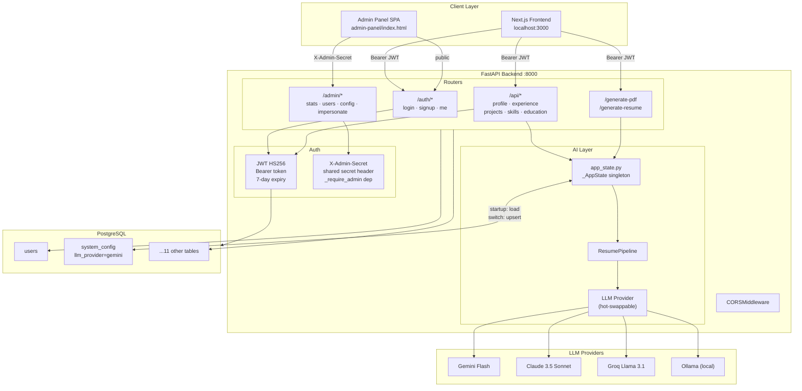
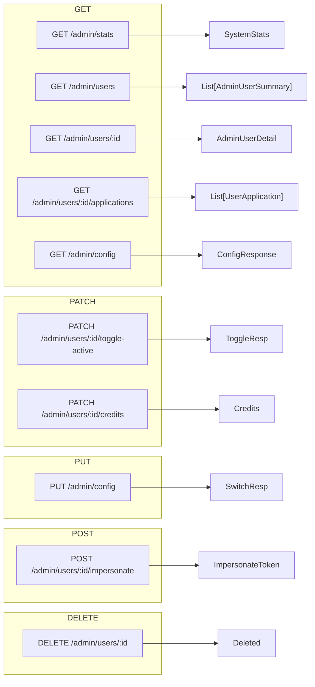
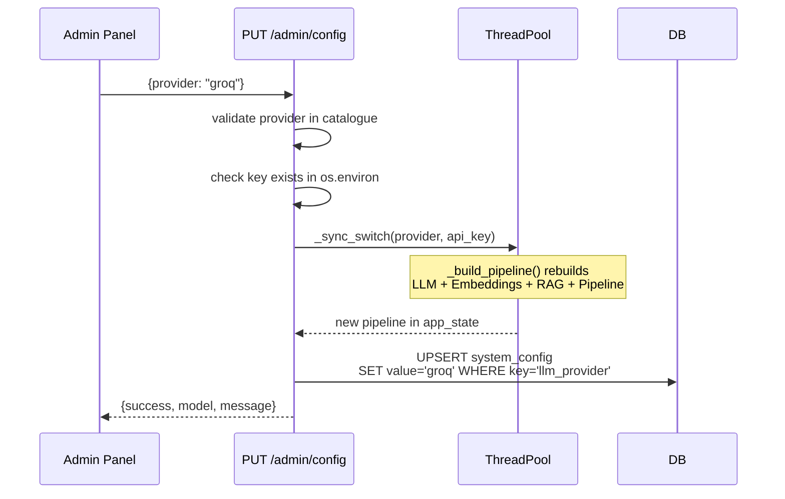
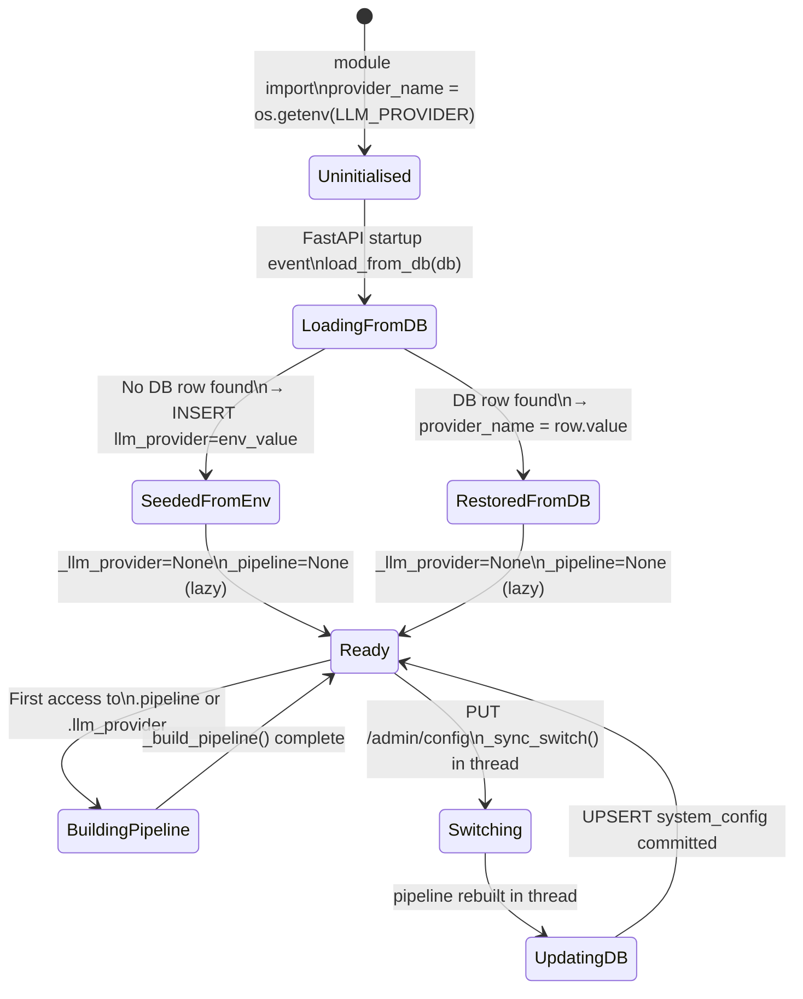
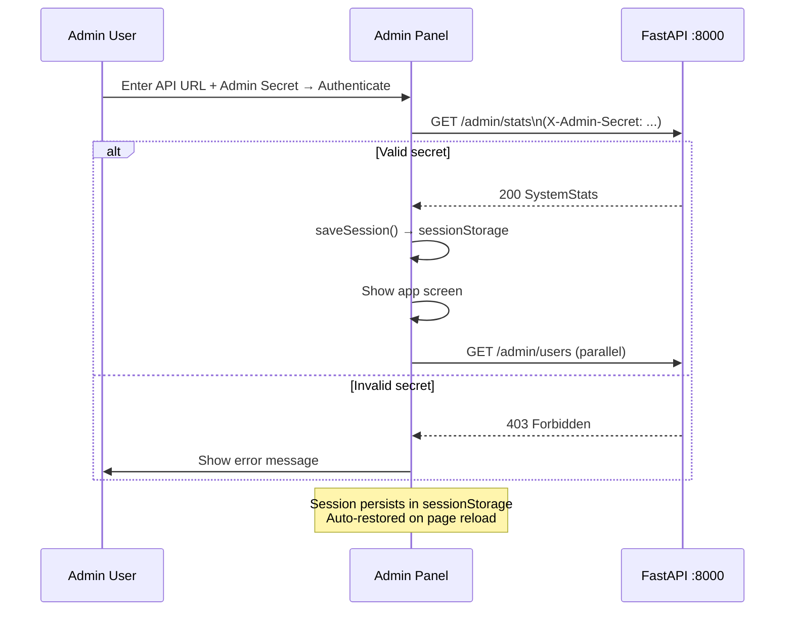
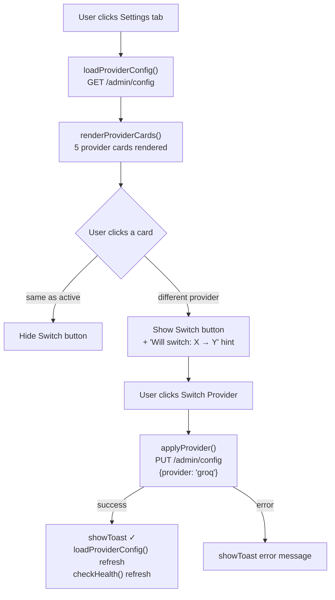
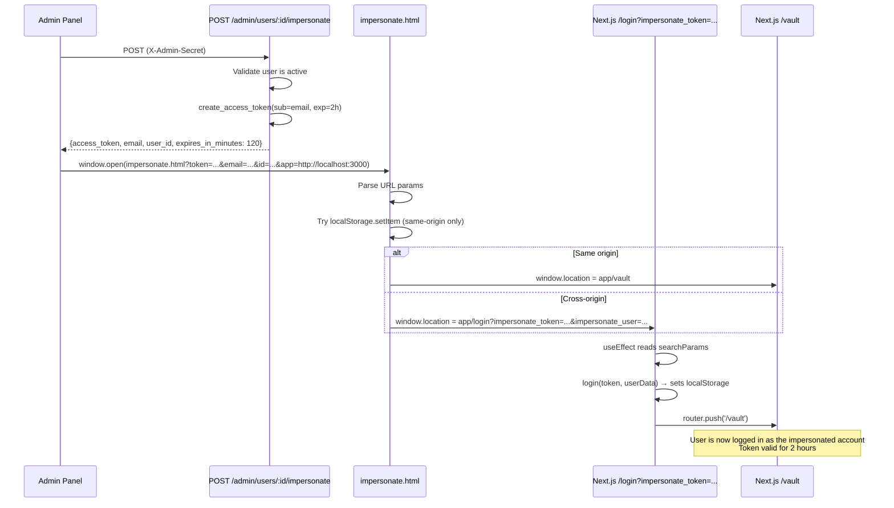

# Career Vault — Admin Panel & AI Config: Implementation Plan

> **Scope:** Decoupled admin monitoring panel, runtime LLM provider switching (DB-persisted), and user impersonation.  
> **Stack:** FastAPI · SQLAlchemy (async) · PostgreSQL · Vanilla HTML/CSS/JS  

---

## Table of Contents

1. [System Architecture](#1-system-architecture)
2. [Database Schema](#2-database-schema)
3. [Backend — Admin API](#3-backend--admin-api)
   - [Authentication Guard](#31-authentication-guard)
   - [Endpoint Map](#32-endpoint-map)
   - [User Management Endpoints](#33-user-management-endpoints)
   - [LLM Config Endpoints](#34-llm-config-endpoints)
   - [User Impersonation Endpoint](#35-user-impersonation-endpoint)
4. [App State — Runtime Provider Management](#4-app-state--runtime-provider-management)
   - [Provider Catalogue](#41-provider-catalogue)
   - [Startup DB Sync](#42-startup-db-sync)
   - [Hot-Swap Flow](#43-hot-swap-flow)
5. [CORS Configuration](#5-cors-configuration)
6. [Admin Panel Frontend](#6-admin-panel-frontend)
   - [File Structure](#61-file-structure)
   - [Authentication Flow](#62-authentication-flow)
   - [Dashboard](#63-dashboard)
   - [Users Tab](#64-users-tab)
   - [Settings Tab — Provider Switcher](#65-settings-tab--provider-switcher)
7. [User Impersonation Flow](#7-user-impersonation-flow)
8. [Key Design Decisions](#8-key-design-decisions)
9. [Security Considerations](#9-security-considerations)
10. [Environment Variables Reference](#10-environment-variables-reference)

---

## 1. System Architecture



---

## 2. Database Schema

```mermaid
erDiagram
    users {
        UUID        id          PK
        VARCHAR255  email       UK
        VARCHAR255  password_hash
        BOOLEAN     is_active
        TIMESTAMPTZ created_at
    }
    user_profiles {
        UUID    user_id     PK-FK
        VARCHAR first_name
        VARCHAR last_name
        VARCHAR location
        VARCHAR phone
        TEXT    summary
        VARCHAR title
    }
    user_settings {
        UUID    user_id             PK-FK
        INTEGER ai_credits
        VARCHAR preferred_template_id
        JSONB   font_settings
    }
    user_experiences {
        UUID    id          PK
        UUID    user_id     FK
        VARCHAR company
        VARCHAR role
        DATE    start_date
        DATE    end_date
        BOOLEAN is_current
        ARRAY   bullets
        INTEGER display_order
    }
    user_projects {
        UUID    id      PK
        UUID    user_id FK
        VARCHAR name
        TEXT    description
        ARRAY   bullets
        VARCHAR tech_stack
        DATE    start_date
        DATE    end_date
        INTEGER display_order
    }
    user_skills {
        UUID    id          PK
        UUID    user_id     FK
        VARCHAR name
        VARCHAR category
        INTEGER proficiency
    }
    user_education {
        UUID    id          PK
        UUID    user_id     FK
        VARCHAR institution
        VARCHAR degree
        VARCHAR field
        DATE    start_date
        DATE    end_date
        DECIMAL gpa
    }
    job_applications {
        UUID        id           PK
        UUID        user_id      FK
        VARCHAR     job_title
        VARCHAR     company_name
        VARCHAR     job_url
        VARCHAR     status
        TIMESTAMPTZ applied_at
    }
    resumes {
        UUID        id              PK
        UUID        application_id  FK-UK
        JSONB       generated_bullets
        VARCHAR     pdf_path
        TIMESTAMPTZ created_at
    }
    system_config {
        VARCHAR128  key         PK
        TEXT        value
        TIMESTAMPTZ updated_at
    }

    users ||--o| user_profiles      : "has"
    users ||--o| user_settings      : "has"
    users ||--o{ user_experiences   : "has many"
    users ||--o{ user_projects      : "has many"
    users ||--o{ user_skills        : "has many"
    users ||--o{ user_education     : "has many"
    users ||--o{ job_applications   : "has many"
    job_applications ||--o| resumes : "may have"
```

### `system_config` table

| Key | Value | Purpose |
|---|---|---|
| `llm_provider` | `gemini` \| `anthropic` \| `groq` \| `ollama` \| `gemma_ollama` | Active LLM provider — read on startup, written on switch |

**Migration:** `089b03732db0_add_system_config_table.py`

---

## 3. Backend — Admin API

### 3.1 Authentication Guard

All `/admin/*` routes use a FastAPI dependency that validates a shared secret header — completely **decoupled** from user JWT auth:

```python
# api/admin.py
ADMIN_SECRET = os.getenv("ADMIN_SECRET", "admin_secret_change_me")

def _require_admin(x_admin_secret: Optional[str] = Header(None)):
    if not x_admin_secret or x_admin_secret != ADMIN_SECRET:
        raise HTTPException(status_code=403, detail="Forbidden: invalid or missing admin secret")
```

Applied as a router-level dependency:

```python
router = APIRouter(prefix="/admin", tags=["admin"])

@router.get("/stats", dependencies=[Depends(_require_admin)])
```

### 3.2 Endpoint Map



### 3.3 User Management Endpoints

#### `GET /admin/stats` → `SystemStats`
```python
class SystemStats(BaseModel):
    total_users: int
    active_users: int
    inactive_users: int
    total_experiences: int
    total_projects: int
    total_skills: int
    total_applications: int
    total_resumes: int
```
Uses `func.count()` aggregates across all relevant tables in a single async DB session.

#### `GET /admin/users` → `List[AdminUserSummary]`
```python
class AdminUserSummary(BaseModel):
    id: str
    email: str
    is_active: bool
    created_at: Optional[datetime]
    first_name: Optional[str]
    last_name: Optional[str]
    ai_credits: Optional[int]
    experience_count: int
    project_count: int
    skill_count: int
    application_count: int
```
Iterates all users and fires per-user count queries. Ordered by `created_at DESC`.

#### `PATCH /admin/users/:id/toggle-active`
Flips `User.is_active` and commits. Returns new state + human-readable message.

#### `PATCH /admin/users/:id/credits`
```python
class UpdateCreditsRequest(BaseModel):
    ai_credits: int
```
Updates `UserSettings.ai_credits`. Validates the settings row exists first.

#### `DELETE /admin/users/:id`
Calls `await db.delete(user)` — all child rows cascade via FK `ON DELETE CASCADE`.

### 3.4 LLM Config Endpoints

#### `GET /admin/config` → `ConfigResponse`
```python
class ProviderInfo(BaseModel):
    id: str           # "gemini"
    name: str         # "Google Gemini"
    model: str        # "gemini-3-flash-preview"
    description: str
    requires_key: bool
    key_env: Optional[str]   # "GEMINI_API_KEY"
    local: bool
    has_key: bool     # bool(os.getenv(key_env))
    is_active: bool   # provider_name == p["id"]

class ConfigResponse(BaseModel):
    current_provider: str
    providers: List[ProviderInfo]
```

Reads from `app_state.catalogue_with_status()` — enriches the static catalogue with live `has_key` and `is_active` flags.

#### `PUT /admin/config`
```python
class ConfigUpdateRequest(BaseModel):
    provider: str
    api_key: Optional[str] = None
```

Flow:



`_sync_switch` runs in `asyncio.to_thread` because `_build_pipeline()` is CPU/IO-bound (imports, model init). The DB upsert stays on the async event loop.

### 3.5 User Impersonation Endpoint

#### `POST /admin/users/:id/impersonate` → `ImpersonateResponse`

```python
class ImpersonateResponse(BaseModel):
    access_token: str
    token_type: str       # "bearer"
    user_id: str
    email: str
    expires_in_minutes: int  # 120 (2 hours vs normal 7 days)
```

Implementation:
```python
token = create_access_token(
    data={"sub": user.email},
    expires_delta=timedelta(minutes=120)
)
```

Uses the same `create_access_token` from `auth/security.py` — the resulting JWT is **valid** for any endpoint that uses `get_current_user`. Guards:
- Returns `404` if user not found
- Returns `400` if user is **inactive** (cannot impersonate deactivated accounts)

---

## 4. App State — Runtime Provider Management

**File:** `app_state.py`

The `_AppState` singleton keeps the live pipeline objects in memory (they cannot be serialised). The **provider name** is the only thing stored in the DB.



### 4.1 Provider Catalogue

Defined as a static list in `app_state.py`:

| ID | Name | Model | Key Env | Local |
|---|---|---|---|---|
| `gemini` | Google Gemini | `gemini-3-flash-preview` | `GEMINI_API_KEY` | No |
| `anthropic` | Anthropic Claude | `claude-3-5-sonnet-20241022` | `ANTHROPIC_API_KEY` | No |
| `groq` | Groq (Llama) | `llama-3.1-8b-instant` | `GROQ_API_KEY` | No |
| `ollama` | Ollama (Llama 3.1) | `llama3.1:8b` | — | Yes |
| `gemma_ollama` | Ollama (Gemma 2) | `gemma2:9b` | — | Yes |

### 4.2 Startup DB Sync

```python
# main.py
from db.database import AsyncSessionLocal

@app.on_event("startup")
async def _on_startup():
    async with AsyncSessionLocal() as db:
        await app_state.load_from_db(db)
    logger.info(f"[Startup] Active LLM provider: {app_state.provider_name}")
```

`load_from_db` logic:
```python
async def load_from_db(self, db) -> None:
    saved = await _db_get(db, "llm_provider")  # SELECT from system_config
    if saved:
        self.provider_name = saved
        self._pipeline = None  # force lazy rebuild
    else:
        # First boot — seed DB from env
        await _db_set(db, "llm_provider", self.provider_name)
```

### 4.3 Hot-Swap Flow

```python
def _build_pipeline(provider_name: str):
    llm      = _build_provider(provider_name)    # LLM instantiation
    emb      = _build_embeddings(provider_name)  # HF / Ollama / Keyword
    store    = InMemoryVectorStore(emb)
    retriever = RAGRetriever(store)
    return llm, ResumePipeline(llm, retriever)
```

Embeddings priority:
1. `HUGGINGFACE_API_KEY` set → `HuggingFaceEmbeddings`
2. Local provider (ollama/gemma_ollama) → `OllamaEmbeddings`
3. Fallback → `KeywordEmbeddings` (zero dependencies)

---

## 5. CORS Configuration

```python
# main.py
_allow_all = os.getenv("ALLOW_ALL_ORIGINS", "false").lower() == "true"
_cors_origins = ["*"] if _allow_all else [o.strip() for o in CORS_ORIGINS.split(",")]

app.add_middleware(
    CORSMiddleware,
    allow_origins=_cors_origins,
    allow_credentials=not _allow_all,  # wildcard + credentials invalid per spec
    allow_methods=["*"],
    allow_headers=["*"],
)
```

| Environment | `ALLOW_ALL_ORIGINS` | `allow_origins` | Notes |
|---|---|---|---|
| Local dev (file://) | `true` | `["*"]` | Admin panel opened directly from filesystem |
| Local dev (served) | `false` | explicit list | `http://localhost:5500`, `:3000`, `:5173` |
| Production | `false` | `CORS_ORIGINS` env | Vercel/Render URLs only |

> ⚠️ **Never** set `ALLOW_ALL_ORIGINS=true` in production.

---

## 6. Admin Panel Frontend

### 6.1 File Structure

```
admin-panel/
├── index.html          # Single-page app shell (login screen + app screen)
├── style.css           # Full design system — dark glassmorphism theme
├── app.js              # All logic — auth, API calls, rendering, settings
└── impersonate.html    # Bridge page for user impersonation redirect
```

**Zero dependencies** — no npm, no bundler, no framework. Pure HTML/CSS/JS served from any static server.

### 6.2 Authentication Flow



API base URL and secret are stored in `sessionStorage` (tab-scoped, cleared on close):
```javascript
function saveSession() {
    sessionStorage.setItem('cv_admin_base',   API_BASE);
    sessionStorage.setItem('cv_admin_secret', ADMIN_SECRET);
}
```

All API calls go through a single helper:
```javascript
async function api(path, { method = 'GET', body } = {}) {
    const res = await fetch(`${API_BASE}${path}`, {
        method,
        headers: {
            'Content-Type': 'application/json',
            'X-Admin-Secret': ADMIN_SECRET,
        },
        body: body ? JSON.stringify(body) : undefined,
    });
    if (!res.ok) throw new Error((await res.json()).detail || `HTTP ${res.status}`);
    return res.json();
}
```

### 6.3 Dashboard

- **Stats grid:** 8 metric cards (users, active, inactive, experiences, projects, skills, applications, resumes) — populated by `GET /admin/stats`
- **Recent Users list:** Top 5 by join date — populated by `GET /admin/users` slice
- **System Health card:** Pings `GET /health`, displays provider name, model, API URL

### 6.4 Users Tab

**Toolbar:** Live search (name/email) + filter tabs (All / Active / Inactive)

**Table columns:** User · Status · Joined · AI Credits · Experiences · Projects · Applications · Actions

**Action buttons per row:**

| Button | Action |
|---|---|
| View | Opens detail modal |
| ⚡ Login | `quickLogin()` → impersonation |
| Deactivate/Activate | `quickToggle()` → `PATCH .../toggle-active` |

**User Detail Modal** includes:
- Profile fields (location, phone, template, summary)
- AI Credits editor with save
- Job applications list
- Footer: `⚡ Login as User` · Deactivate/Activate · Delete User · Close

### 6.5 Settings Tab — Provider Switcher



Card states:

| CSS class | Visual indicator | Meaning |
|---|---|---|
| `active-provider` | Green border + `LIVE` badge | Currently running provider |
| `selected` | Purple border + glow | Card clicked, not yet applied |
| `selected.active-provider` | Both | Selected card is already live |
| `has-key` tag | Green `✓ Key saved` | `os.getenv(KEY_ENV)` truthy |
| `needs-key` tag | Amber `⚠ Needs key` | Key missing from env |
| `local` tag | Green `Local` | No internet required |
| `cloud` tag | Indigo `Cloud` | External API call |

---

## 7. User Impersonation Flow



### Frontend: `login/page.tsx` impersonation hook

```tsx
useEffect(() => {
    const impToken = searchParams.get('impersonate_token');
    const impUser  = searchParams.get('impersonate_user');
    if (!impToken || !impUser) return;

    setImpersonating(true);
    try {
        const userData = JSON.parse(decodeURIComponent(impUser));
        login(decodeURIComponent(impToken), userData);
        // login() calls: localStorage.setItem('token', ...) + router.push('/vault')
    } catch (e) {
        setError('Impersonation failed — invalid token data.');
    }
}, [searchParams]);
```

### Security guards

| Guard | Where |
|---|---|
| `X-Admin-Secret` required | `_require_admin` dep on all `/admin/*` |
| Inactive user blocked | `if not user.is_active: raise 400` |
| Short expiry (2h vs 7d) | `expires_delta=timedelta(minutes=120)` |
| Token is a valid JWT | Accepted by all standard `get_current_user` guards |

---

## 8. Key Design Decisions

### Decoupled admin auth
The admin panel uses a **separate secret header** (`X-Admin-Secret`) instead of a user JWT. This means:
- Admin access can be revoked by changing `ADMIN_SECRET` without affecting user sessions
- Admin panel requires no signup/login in the main DB
- Can be network-restricted independently (e.g. VPN-only in production)

### DB-persisted provider (not `.env`)
Storing `llm_provider` in `system_config` instead of rewriting `.env` gives:
- **Multi-instance safe:** All uvicorn workers read the same DB value
- **No file permissions issue:** No need to write to disk
- **Auditable:** `updated_at` tracks when the switch happened
- **Clean separation:** Runtime config vs deploy config

### In-memory pipeline singleton
The `ResumePipeline` object (and its LLM/embeddings/retriever dependencies) is kept in a module-level singleton (`app_state.state`). Pipeline objects are not serialisable so they cannot live in the DB. Lazy init keeps server startup fast — the pipeline is only built on first use or after a switch.

### `asyncio.to_thread` for pipeline rebuild
`_build_pipeline()` imports ML libraries and initialises clients — potentially slow (100ms–2s). Running this in a thread pool prevents blocking FastAPI's async event loop during provider switches.

---

## 9. Security Considerations

| Risk | Mitigation |
|---|---|
| Admin secret brute-force | Rotate `ADMIN_SECRET` to a cryptographically random value; add rate-limiting in production |
| `ALLOW_ALL_ORIGINS=true` | Only for local dev; must be `false` in production |
| Impersonation token leakage | 2-hour expiry; token only generated on explicit admin action |
| API keys in admin panel response | `has_key` is a **boolean** — the actual key value is never returned to the frontend |
| Delete with no recovery | `DELETE /admin/users/:id` is permanent; add soft-delete before production use |
| `file://` origin | `null` origin only allowed when `ALLOW_ALL_ORIGINS=true`; production always serves from a real URL |

---

## 10. Environment Variables Reference

| Variable | Required | Default | Description |
|---|---|---|---|
| `ADMIN_SECRET` | ✅ | `admin_secret_change_me` | Shared secret for `X-Admin-Secret` header |
| `LLM_PROVIDER` | ✅ | `ollama` | Initial provider (seeded to DB on first boot) |
| `GEMINI_API_KEY` | If using Gemini | — | Google AI Studio key |
| `ANTHROPIC_API_KEY` | If using Anthropic | — | Anthropic console key |
| `GROQ_API_KEY` | If using Groq | — | Groq cloud key |
| `ALLOW_ALL_ORIGINS` | Dev only | `false` | Set `true` to open admin panel as `file://` |
| `CORS_ORIGINS` | Prod | `localhost:3000,...` | Comma-separated allowed origins |
| `DATABASE_URL` | ✅ | local postgres | `postgresql+asyncpg://...` |
| `SECRET_KEY` | ✅ | weak dev key | JWT signing key — must be strong in production |
| `HUGGINGFACE_API_KEY` | Optional | — | Enables HuggingFace embeddings |
