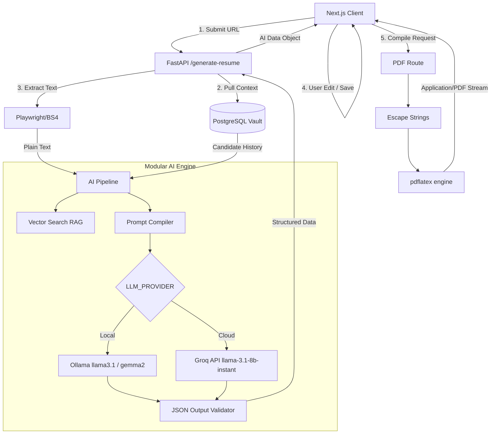

# Comprehensive Technical Architecture - AI Resume Maker

## 1. System Overview
The **AI Resume Maker** is a sophisticated, full-stack application designed to generate perfectly formatted, ATS-compliant, strictly structured PDF resumes. It operates by scraping job descriptions, comparing them with a user's pre-saved professional "vault" (history, skills, projects), and dynamically constructing tailored bullet points using LLMs.

### Core Philosophy
- **Separation of Concerns:** The system strictly separates the UI (Next.js), the API gateway (FastAPI), the AI reasoning pipeline (LLM Providers + LangChain-inspired logic), data persistence (PostgreSQL), and document compilation (pdflatex).
- **Provider Agnostic AI:** AI models and providers are abstracted behind a factory pattern, allowing seamless swapping between Local LLMs (Ollama) and Cloud LLMs (Groq).

---

## 2. Architecture Layers

### A. Frontend Layer (Client)
- **Framework:** Next.js 15 (App Router) + TypeScript + React Context API.
- **Styling:** CSS variables, Glassmorphism aesthetic, localized animations.
- **Responsibilities:**
  - **Auth/Session Management:** Handled via Context (`AuthContext.tsx`) managing JWT local storage.
  - **Vault Management:** Real-time state management of the user's professional history. Utilizes `sessionStorage` caching to reduce heavy database re-fetching on navigation.
  - **Workflow Orchestration:** Captures the target URL, triggers backend scraping/AI generation, renders the split-pane workspace (55% Editor / 45% PDF Preview), and detects "dirty" layout states for dynamic recompilation.

### B. API & Backend Services Layer (Server)
- **Framework:** FastAPI (Python 3.10+) running via Uvicorn.
- **Database ORM:** SQLAlchemy (Asyncpg) mapped via Alembic migrations.
- **Endpoints:** 
  - `/auth/*`: JWT creation, password hashing (bcrypt).
  - `/api/vault/*`: CRUD operations for user histories.
  - `/scrape`: Headless browser (Playwright) / static scraping (BeautifulSoup).
  - `/generate-resume`: The master endpoint that orchestrates standard validation, invokes the AI pipeline, and handles response processing.

### C. Artificial Intelligence Pipeline (The Core Engine)
- **Abstraction:** Defined in `ai/interfaces/llm_provider.py`. The `LLM_PROVIDER` factory in `main.py` dynamically injects the appropriate provider.
  - `OllamaProvider`: Connects to `llama3.1:8b` running locally.
  - `GemmaOllamaProvider`: Connects to `gemma2:9b` running locally.
  - `LlamaGroqProvider`: Connects to `llama-3.1-8b-instant` on the Groq Cloud API for lightning-fast, hardware-accelerated inference.
- **RAG (Retrieval-Augmented Generation):**
  - Uses `OllamaEmbeddings` (`nomic-embed-text`) to vectorize text.
  - `InMemoryVectorStore` applies cosine similarity to rank standard ATS bullet point "seeds" against the user's skills and target job.
- **Pipeline Flow:**
  1. **Extraction:** Parses raw HTML into requirements.
  2. **Matching:** Intersects candidate "Vault" skills with Job Keywords.
  3. **Retrieval:** Fetches the top 3 best ATS formatting examples.
  4. **Generation:** Forces the chosen LLM to return strict JSON containing the resume outline.
  5. **Validation:** RegEx intercepts payload padding, ensures valid Pydantic-like structures, and triggers automatic retries if the LLM hallucinates constraints.

### D. PDF Compilation Engine
- **Engine:** `pdflatex` (TeX Live/BasicTeX).
- **Template Injection:** The `pdf/router.py` safely injects plaintext strings into a static `.tex` representation.
- **Security:**
  - Zero LaTeX is generated by the AI to prevent injection attacks and compiling crashes. Strings are rigorously escaped before substitution.
  - `subprocess.run` executes `pdflatex -no-shell-escape` within a constrained asyncio thread with strict timeout timeouts (preventing infinite render loops).

### E. Data Persistence Layer
- **Engine:** PostgreSQL 15+.
- **Models:** Built via highly-normalized schemas mapping `User`, `UserExperience`, `UserProject`, `UserEducation`, `UserSkill`, and `UserProfile`.
- **Identities:** Secure UUID-based primary keys and indexed foreign constraints.

---

## 3. Data Flow Diagram

---

## 4. Environment & Deployment Strategy

The system is designed for high portability and cost-efficiency (Zero-to-Free scaling).

* **Local Dev Stack:**
  * Node.js, Python `.venv`, Docker (PostgreSQL), native Ollama app.
* **Free Tier Cloud Deployment:**
  * **Frontend:** Vercel (Edge network, auto-deployments).
  * **Backend (FastAPI + PDFLaTeX):** Render Free Tier (Web Service running Docker runtime). The Dockerfile must install `texlive-latex-base` alongside Python.
  * **Database:** Neon.tech or Supabase (Severless Postgres).
  * **LLM Engine:** Groq API (Incredible speed, free usage tier).
  * **Embeddings:** HuggingFace Inference API (Optional replacement for nomic).
